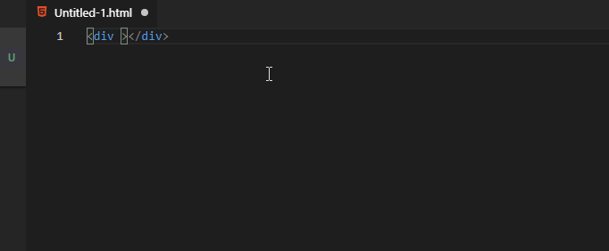
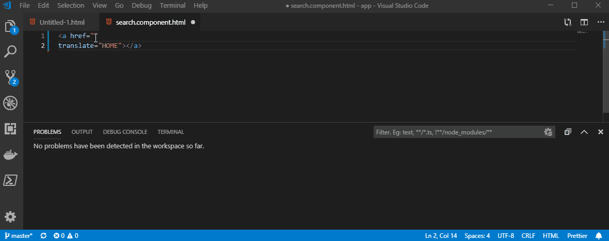
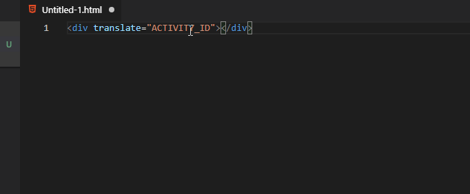

# ngx-translate-lookup

Using [ngx-translate](http://www.ngx-translate.com/) your html will have references to keys being passed through the translate service. It can be hard to know what these translate to and if there are any missing strings until runtime.

## Features

This extension will read a .resx or .json file and then provide intellisense and code completion displaying available keys and values. It will also provide problem reporting of values that do not exist in the resources file.

### Code Completion



### Missing value warnings



### Hover information



### Reload

If the config is changed or the resource dictionary is modified the extension can be reloaded with the 'ngx-translate-lookup.reload' command found in the command menu as 'Reload ngx-translate-lookup dictionary'

## Extension Settings

This extension contributes the following settings:

- 'ngx-translate.lookup.resourcesType': Type of resource file, either .resx or .json.
  - If json then the format should be:
  ```
  {
    "STRING1" : "This is the first",
    "STRING2" : "This is the second"
  }
  ```
- `ngx-translate.lookup.resourcesPath`: Path to a resources file (.resx or.json) file for lookups.
  This can either be a full path ('C:\\\resources.resx') or a relative path ('..\\\\..\\\resources.resx').

  If relative then the setting should be in Workspace settings and will be relative from the first workspace folder opened.

- `ngx-translate.lookup.regex`: Regular expressions used to locate translation string/keys within documents.
  These default to find usages of 'translate="KEY"' and '{{'KEY' | translate}}'
